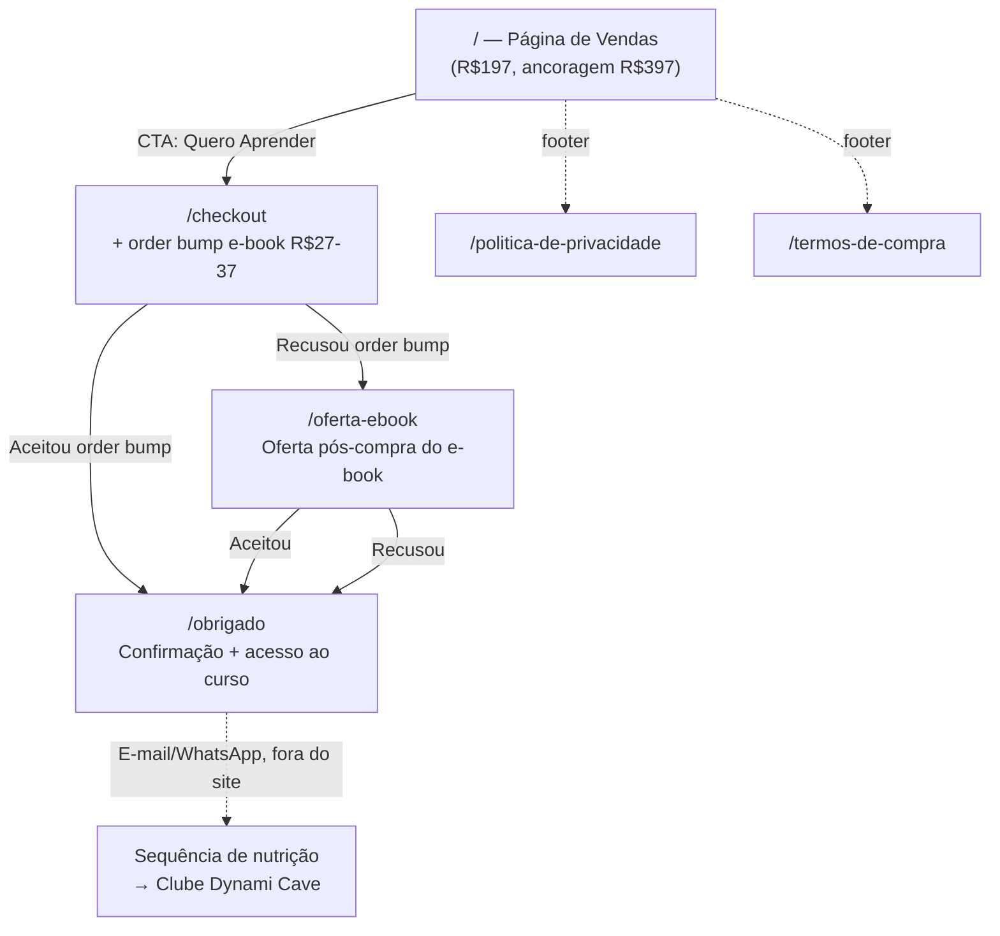

# Arquitetura do Site — "Saindo do Zero" (Empório Dýnami)

> Última atualização: 2026-07-22
> Contexto: `.agents/product-marketing.md` v1 · `docs/brand-guidelines.md` v1.0

## 1. Contexto e tipo de site

Não é um site institucional — é um **funil de vendas linear** para o curso de entrada "Saindo do Zero" (R$197), conforme o Briefing para Agência. Diferente de uma landing page única, o funil precisa de páginas separadas porque cada etapa tem um objetivo de conversão distinto (comprar → aceitar order bump → ver oferta pós-compra → confirmar acesso) e cada uma deve ser mensurável isoladamente (pixel de conversão, taxa de aceite do order bump, etc. — ver KPIs no briefing, seção 9).

**Site type:** Funil de vendas (small business / direct-response), não SaaS nem conteúdo.

**Princípio de navegação:** Sem menu de navegação tradicional. O visitante segue um caminho linear — cada página tem um único próximo passo. Isso é intencional: nav aberta derruba conversão em página de vendas.

## 2. Hierarquia de Páginas (Árvore)

```
Página de Vendas (/)
├── Checkout (/checkout)
│   ├── Order Bump aceito → Confirmação (/obrigado)
│   └── Order Bump recusado → Oferta Pós-Compra (/oferta-ebook)
│       ├── Aceitou → Confirmação (/obrigado)
│       └── Recusou → Confirmação (/obrigado)
├── Obrigado / Acesso (/obrigado)
│   └── (ponto de entrada da nutrição para o Clube Dynami Cave — fora do site, via e-mail/WhatsApp)
├── Política de Privacidade (/politica-de-privacidade)
└── Termos de Compra (/termos-de-compra)
```

**Nota de fluxo:** `/checkout` e `/oferta-ebook` não são destinos de navegação livre — só são alcançados a partir do passo anterior do funil (sem link direto na página de vendas além do CTA de compra).

## 3. Sitemap Visual (Mermaid)



## 4. Mapa de URLs

| Página | URL | Pai | Local no funil | Prioridade |
|--------|-----|-----|-----------------|------------|
| Página de Vendas | `/` | — | Topo — captação e conversão | Alta |
| Checkout | `/checkout` | Página de Vendas | Conversão — compra + order bump | Alta |
| Oferta Pós-Compra (e-book) | `/oferta-ebook` | Checkout | Aumento de ticket (só se recusou order bump) | Média |
| Obrigado / Acesso | `/obrigado` | Checkout ou Oferta | Confirmação — entrega de acesso | Alta |
| Política de Privacidade | `/politica-de-privacidade` | Página de Vendas | Rodapé (compliance) | Baixa |
| Termos de Compra | `/termos-de-compra` | Página de Vendas | Rodapé (compliance) | Baixa |

## 5. Especificação de Navegação

**Header (todas as páginas do funil):** Sem menu. Apenas wordmark "EMPÓRIO DÝNAMI" (não clicável ou linkando para `/`, ver decisão abaixo) + selo discreto de credibilidade (ex. "curso oficial Empório Dýnami"). Isso sustenta a diretriz do briefing: *"toda peça deve, de forma discreta, sustentar a percepção de que existe uma marca maior e mais sofisticada por trás do curso"* sem abrir rota de saída do funil.

- **Decisão de UX:** o wordmark do header **não é clicável** durante `/checkout` e `/oferta-ebook` (reduz abandono no momento de pagamento). Na página de vendas (`/`), pode ser não-clicável também, já que não há "home" para onde voltar dentro do funil.

**Footer (apenas na Página de Vendas):** Política de Privacidade, Termos de Compra, contato de suporte (WhatsApp). Checkout e páginas de oferta usam footer minimalista (só selos de segurança de pagamento) para não distrair.

**Breadcrumbs:** Não se aplica — funil linear, não hierarquia de conteúdo.

## 6. Estrutura de seções — Página de Vendas (`/`)

Ordem baseada no framework de copy (abertura → desenvolvimento → prova → oferta → CTA, ver skill `copywriting`) e no conteúdo já definido no briefing:

1. **Hero** — dor + promessa (insegurança social com vinho → confiança prática)
2. **Problema/Agitação** — "você já passou por isso?" (objeções do público 25-55 anos, classe B/B+)
3. **Solução/Mecanismo** — o curso, 4 aulas, tom sem pedantismo
4. **O que você recebe** — estrutura do curso + bônus (quiz, ficha de degustação, comunidade, certificado, curadoria trimestral)
5. **Prova social** — depoimentos em vídeo, contador de alunos formados (a popular quando disponível)
6. **Autoridade da marca-mãe** — menção discreta ao ecossistema Dýnami (sem desviar foco do CTA)
7. **Oferta e preço** — ancoragem R$397 → R$197 (12x R$19,70), selo "sem enrolação"
8. **Garantia/Risco reverso** — a definir com skill `offers`
9. **FAQ / Objeções** — replica as objeções do público-alvo do documento de personas
10. **CTA final** — reforço de escassez real (turma/vagas, não urgência artificial)

## 7. Plano de Linkagem Interna

- Página de Vendas → Checkout: único CTA relevante, repetido em múltiplos pontos da página (hero, pós-prova social, final) — todos apontam para o mesmo destino `/checkout`
- Checkout → Oferta ou Obrigado: determinado pela lógica de order bump, não por link de navegação manual
- Obrigado: sem links de saída além de instrução de próximo passo (acessar curso, entrar no grupo) — a nutrição para o Clube acontece por e-mail/WhatsApp, fora do site
- Rodapé da Página de Vendas: únicos links "não-funil" (privacidade, termos) — sem risco de fuga de conversão pois ficam fora da dobra

## 8. Padrão de URL

- Minúsculas, com hífen, sem acento/caracteres especiais (`/oferta-ebook`, não `/oferta-ebook-pós-compra`)
- Sem parâmetros de query para conteúdo — parâmetros de UTM ficam reservados para tracking de campanha (`?utm_source=...`), nunca para roteamento
- Sem paginação/data na URL (não se aplica a este funil)

## Próximos passos

Com a arquitetura definida, o próximo passo é aplicar a skill `offers` para desenhar a oferta completa (bônus, garantia, ancoragem de preço) antes de escrever o copy final com a skill `copywriting`.
